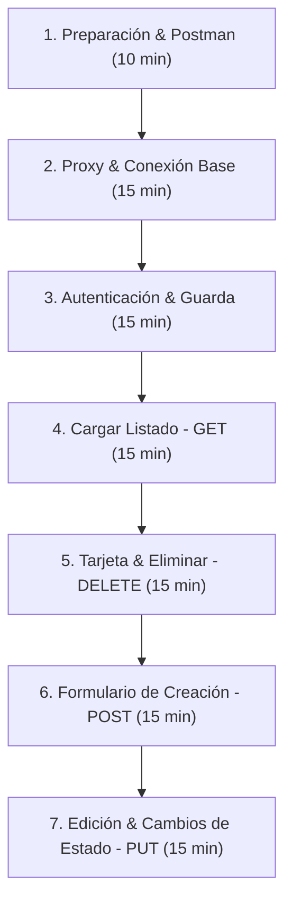

# Guía de Estrategia, Diagnóstico y Control para el Parcial de Frontend

Esta guía resume las estrategias de desarrollo rápido, los puntos de control clave que debes revisar en el código backend de Java (Spring Boot) y las técnicas de diagnóstico para solucionar fallos rápidamente durante el examen.

---

## 🔍 Parte 1: Qué mirar del Backend para alinear tu Frontend

Antes de escribir código en React, debes examinar el proyecto backend. Abre el código en Java y localiza los siguientes ficheros clave:

### 1. El Puerto y la URL base del Backend
Abre el archivo `src/main/resources/application.properties` o `application.yml` del backend:
*   Busca la propiedad `server.port`. Por defecto suele ser `8080`.
*   Busca si hay un prefijo global configurado, como `server.servlet.context-path`. Si existe y es `/api/v1`, entonces tu base de Axios debe tener ese prefijo.

### 2. Los Endpoints y Métodos HTTP en los Controladores
Busca las clases Java anotadas con `@RestController` (usualmente en el paquete `controller`):
*   **Ruta Base del Recurso**: Mira la anotación `@RequestMapping("/vuelos")` o `@RequestMapping("/domicilios")` en la parte superior de la clase.
*   **Métodos del CRUD**:
    *   `GET` (Listar): Anotado con `@GetMapping`. Confirma si devuelve una lista simple.
    *   `POST` (Crear): Anotado con `@PostMapping`.
    *   `PUT` (Editar): Anotado con `@PutMapping("/{id}")`.
    *   `DELETE` (Eliminar): Anotado con `@DeleteMapping("/{id}")`.

### 3. El Cuerpo de la Petición (`@RequestBody` y DTOs)
Mira los parámetros de los métodos `POST` y `PUT` en los controladores Java:
*   Si tienen la anotación `@RequestBody VueloRequest dto` o similar, abre esa clase Java (`VueloRequest.java` o `DomicilioRequest.java`) en el paquete `dto` o `request`.
*   **Apunta el nombre exacto de las variables**: El JSON que envíes desde React en tu `axiosInstance.post` o `put` debe tener **exactamente** las mismas llaves y tipos de datos en camelCase.
    *   *Ejemplo*: Si en Java la variable es `String numeroVuelo`, en React debes enviar `{ numeroVuelo: "AV123" }`. Si envías `{ numero_vuelo: ... }` o `{ numero: ... }`, el servidor responderá con **Error 400 (Bad Request)**.

### 4. Estructura de la Respuesta del Login
Busca el controlador de autenticación (suele llamarse `AuthController.java`):
*   Mira qué objeto devuelve el método de login exitoso (ej: `LoginResponse` o `JwtResponse`).
*   Abre esa clase y verifica el nombre de la variable que contiene el token JWT.
    *   ¿Se llama `token`? (`res.token`)
    *   ¿Se llama `accessToken`? (`res.accessToken`)
    *   ¿Se llama `jwt`? (`res.jwt`)
    *   *Debes guardar la propiedad correcta en tu localStorage en `LoginPage.jsx`.*

### 5. ¿El Backend exige ID del Padre/Propietario?
Muchos parciales vinculan el recurso creado al usuario autenticado (ej: asociar un vuelo a la aerolínea logueada, o un pedido al repartidor logueado).
*   Revisa el DTO de creación (`POST`) en Java. Si exige un campo como `aerolineaId` o `userId`, pero ese ID no viene codificado en el token JWT, tienes que enviarlo manualmente en el cuerpo de tu POST.
*   **Estrategia**: Carga el listado (`GET`) al arrancar el dashboard. Si la lista contiene elementos, extrae el ID asociado del primer elemento (`data[0].aerolineaId` o `data[0].userId`) usando un `useRef` en React y envíalo en el JSON al crear nuevos registros.

---

## ⏱️ Parte 2: Estrategia de Resolución paso a paso en el Parcial

Para optimizar tu tiempo (usualmente 2 horas) y asegurar que cada sección funcione antes de pasar a la siguiente, sigue este orden táctico:

### Paso 1: Comprobación del Backend y datos de prueba (10 min)
1. Levanta el backend en IntelliJ/Eclipse y asegúrate de que no haya fallos.
2. Abre Postman u otra herramienta y haz un POST de prueba a `/auth/login` con los datos de prueba descritos en el PDF del examen.
3. Copia el token devuelto y haz un GET manual a `/vuelos` o `/domicilios` pasando el header `Authorization: Bearer <token>` para confirmar que la base de datos tiene datos de prueba y responde correctamente.

### Paso 2: Proxy y Conexión Base en React (15 min)
1. Configura el puerto del backend en tu `vite.config.js` (sección `server.proxy`).
2. Crea `src/api/axiosInstance.js`. Deja la URL relativa (`baseURL: '/api/v1'`) y añade los interceptores para inyectar el token JWT y extraer el `.data` automáticamente.
3. Levanta el frontend con `npm run dev`.

### Paso 3: Login y Flujo de Sesión (15 min)
1. Configura las rutas en `src/App.jsx` y crea el componente `ProtectedRoute.jsx`.
2. Implementa `LoginPage.jsx`. Asegúrate de que guarde el token en `localStorage` con la llave exacta (`'token'`) y navegue a `"/"`.
3. Prueba loguearte en el navegador. Si el login es exitoso, la aplicación debe redirigirte al Dashboard. Si borras el token manualmente de la pestaña *Application* de las herramientas de desarrollador y refrescas, debe echarte de vuelta al login.

### Paso 4: El GET - Listado Crudo (15 min)
1. Define la función de llamado `getRecursos` en tu archivo API.
2. En `DashboardPage.jsx`, escribe el `useEffect` para llamar a la API y guárdalo en un estado de React (`setRecursos`).
3. **Punto de Control**: Pinta temporalmente la información en crudo en tu pantalla usando `{JSON.stringify(recursos)}`. Si ves el JSON pintado en la pantalla, tu conexión, token e interceptor están funcionando al 100%.

### Paso 5: Tarjeta y Eliminación (15 min)
1. Crea tu componente `RecursoCard.jsx` usando componentes estructurados de MUI (`Card`, `CardContent`, `Typography`). Mapea los campos del JSON.
2. Programa la función de eliminación (`delete`) directamente en la tarjeta.
3. Al hacer clic en "Eliminar", ejecuta la petición y en el bloque `then/try` ejecuta la función callback `onRefresh()` provista por el Dashboard para actualizar el listado en la pantalla del usuario.

### Paso 6: Formulario de Creación (15 min)
1. Escribe el formulario de creación arriba de la lista en `DashboardPage.jsx`.
2. Asocia los inputs (`TextField` de MUI) a estados locales de React (`useState`).
3. Llama a `createRecurso` al enviar el formulario y refresca la lista llamando a tu cargador de datos.

### Paso 7: Actualización de Estado (15 min)
1. Agrega el selector (`Select` de MUI) en tu tarjeta `RecursoCard.jsx`.
2. Asocia su evento `onChange` a una función que envíe el `PUT` al backend.
3. Recuerda: Al editar un recurso mediante `PUT`, los backends de Spring Boot suelen validar todo el DTO de entrada. Envía el objeto con todas sus llaves originales, cambiando únicamente el estado.

---

## 🛠️ Parte 3: Diagnóstico y Solución de Errores Comunes (Troubleshooting)

Cuando algo falle durante el desarrollo, abre las herramientas del desarrollador del navegador (F12) en la pestaña **Console** (Consola) y **Network** (Red) y aplica estas soluciones según el código de error HTTP:

### 🔴 Error 401: Unauthorized (No autorizado)
*   **Causa**: El backend no recibió el token JWT, o el token enviado no es válido o expiró.
*   **Solución**:
    1. Abre la pestaña **Network** (Red) en el navegador, haz clic en la petición fallida y ve a la sección de cabeceras (*Headers*). Verifica si aparece la cabecera `Authorization: Bearer <tu_token>`.
    2. Si no aparece, el interceptor de peticiones en `axiosInstance.js` no está leyendo la clave correcta de `localStorage` o el token no se guardó tras el login.
    3. Si aparece pero sigue fallando, verifica si tu backend de Spring exige un prefijo diferente (ej: `Bearer` sin espacio, o requiere otra cabecera).

### 🔴 Error 400: Bad Request (Petición incorrecta)
*   **Causa**: Estás enviando un JSON con campos que el backend no comprende o faltan campos obligatorios.
*   **Solución**:
    1. Abre la pestaña **Network** (Red), ve a la petición fallida y revisa la pestaña **Payload** (Cuerpo de la petición). Compara el JSON enviado con la clase DTO en Java.
    2. Verifica la escritura exacta en camelCase (ej: `numeroVuelo` vs `numerovuelo` o `numero_vuelo`).
    3. Revisa si enviaste un tipo de dato incorrecto (ej: enviaste el string `"5"` para un campo numérico como `aerolineaId` y el backend no pudo parsearlo).

### 🔴 Error 403: Forbidden (Prohibido)
*   **Causa**: Estás autenticado pero tu usuario no posee el rol o los privilegios configurados en Spring Security para consumir ese endpoint.
*   **Solución**:
    1. Comprueba con qué usuario te has autenticado. En algunos parciales hay usuarios del tipo "ADMIN" y otros "USER" o nombres de aerolíneas específicas. Revisa el PDF de requerimientos.

### 🔴 Error 404: Not Found (No encontrado)
*   **Causa**: La URL a la que intentas hacer la petición no coincide con las rutas mapeadas en los controladores Java.
*   **Solución**:
    1. Compara la URL de la petición fallida en **Network** con la ruta escrita en el `@RequestMapping` y `@GetMapping`/`@PostMapping` del controlador Java.
    2. Ojo con las barras diagonales (`/`). Si la ruta base es `/api/v1/vuelos` y el endpoint de eliminar es `/{id}`, la ruta final es `/api/v1/vuelos/5`. Verifica que no estés duplicando barras (`/api/v1//vuelos/5`).

### 🔴 Error 500: Internal Server Error (Error interno del servidor)
*   **Causa**: El frontend envió la petición pero ocurrió un error/excepción no controlada en el código Java.
*   **Solución**:
    1. **No mires la consola del navegador**, no te dará detalles. Abre la terminal de **IntelliJ/Eclipse** donde corre tu backend.
    2. Busca la línea roja de excepción (StackTrace). Los errores típicos en parciales son:
        *   `NullPointerException`: Intentaste insertar un registro con un ID de aerolínea o usuario que no existe en la base de datos H2.
        *   `DataIntegrityViolationException`: Violación de restricción de base de datos (por ejemplo, intentar guardar un número de vuelo que ya está registrado y es único).

### 🔴 Error de CORS (Cross-Origin Resource Sharing)
*   **Causa**: Estás intentando llamar directamente a `http://localhost:8080/api/v1/...` desde el puerto `5173` de React sin configurar proxies.
*   **Solución**:
    1. Asegúrate de que la propiedad `baseURL` en tu `axiosInstance.js` sea `/api/v1` (relativa).
    2. Comprueba que el proxy en `vite.config.js` esté apuntando al puerto correcto del backend.
    3. Reinicia el servidor de desarrollo de React (`npm run dev`) tras modificar `vite.config.js`, ya que los cambios en este archivo no se recargan en caliente.
